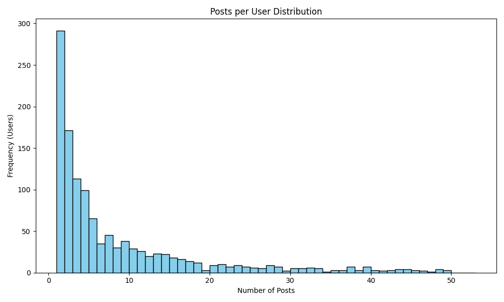
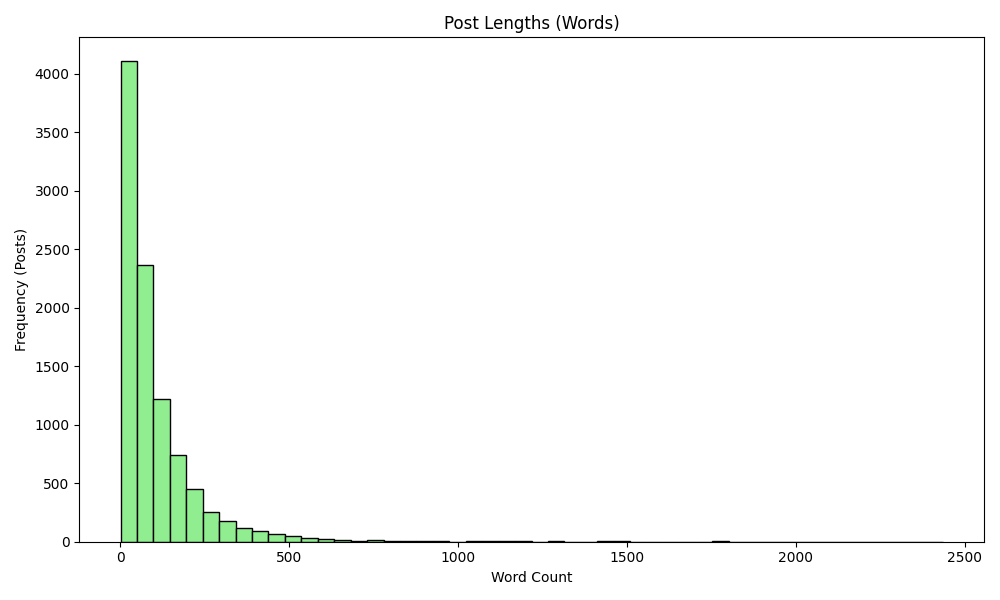
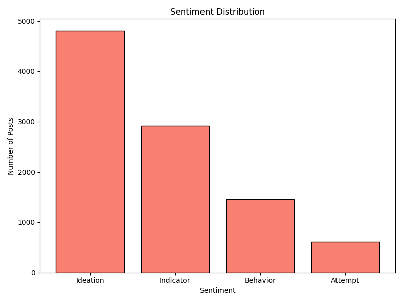

# Suicide Detection Data Exploratory Analysis

This directory contains various datasets for suicide detection classification experiments. The raw data is attached, the randomized version is not kept for space purpose. 

## Datasets Available
- `rsd_15k.csv`: Original full dataset.
- `rsd_15k_single_posters.csv`: Data for users with exactly 1 post.
- `rsd_15k_stacked_posters.csv`: Stacked posts for users with multiple posts holding the same sentiment.
- `rsd_15k_last_post.csv`: Contains only the chronologically latest post for each user.

## Exploratory Data Analysis (`rsd_15k.csv`)

### Basic Statistics
- **Total Posts:** 14613
- **Total Unique Users:** 1265
- **Average Posts per User:** 11.55

### Post Lengths
- **Average Word Count:** 94.88 words
- **Median Word Count:** 55.0 words

### Label Distribution
```text
sentiment
Ideation     7133
Indicator    4615
Behavior     2056
Attempt       809
```

## Visualizations

### Posts per User Distribution


### Post Lengths (Words)


### Sentiment Distribution

